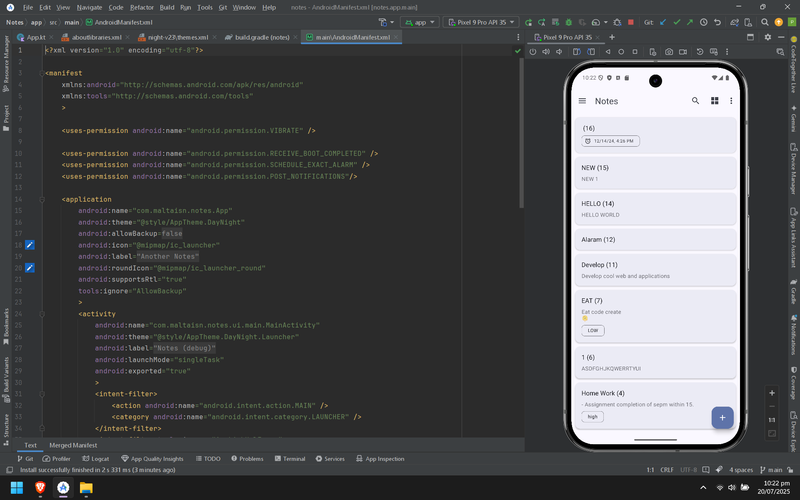
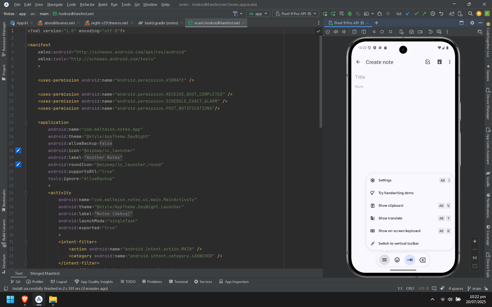
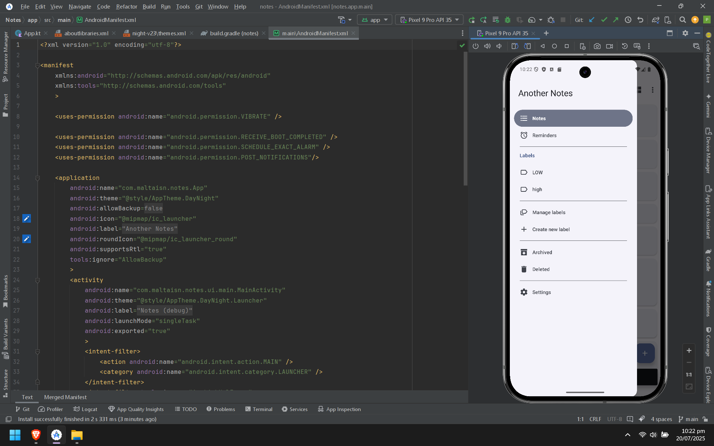

# 📱 Notes Application

A modern Android application built with Kotlin, leveraging Jetpack components, modern libraries, and MVVM architecture.  

---

## 🚀 Features

- ✨ Material 3 design with smooth UI
- 📆 Recurrence picker (RecurPicker v2.1.7)
- 💾 Local database via Room
- 🧭 Navigation Component
- 🧱 Modular architecture
- 📚 AboutLibraries integration
- 🧪 Unit and UI testing with Espresso & JUnit

---

## 🛠 Tech Stack

| Technology         | Version   |
|--------------------|-----------|
| Kotlin             | 1.9.22    |
| AndroidX           | ✅        |
| Room               | 2.6.1     |
| Material Components | 1.11.0    |
| Navigation         | 2.7.6     |
| Lifecycle          | 2.6.2     |
| ConstraintLayout   | 2.1.4     |
| Dagger             | 2.47      |
| LeakCanary         | 2.12      |

---

## 📸 Screenshots:

---

---

